**Pan Cancer analysis of Immune gene Repertoire: Analyzing Gene expression patterns across 13 cancer types                                                   \-**Anik Dey

Cancer is one of the most common causes of death all across the world, posing a profound global public health challenge. According to the statistics of 2018-2022, the cases of cancer are about 445.8 and a death rate of 144.5 per 100,000 men and women. In 2022 alone, there were 20 million new reported cases of cancer and about 9.7 million deaths caused by it. It is extremely concerning as it is projected that by the year 2050, the cases will rise to 33 million with deaths up to 18.2 million (National Cancer Institute).

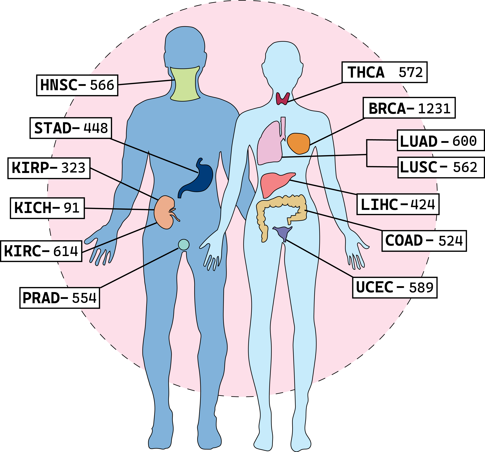

The development and proliferation of cancer are multifaceted, involving genetic mutations as well as physiological changes and the defence mechanism (10.1016/j.cell.2010.01.025). At the core of the cancer complexity lies the paradoxical nature of the immune response of the body. Research reflects the role the immune system plays in the Cancer mechanism, acting against as well as being the guardian and driving the proliferation of cancer. This duality has particularly been noted in TME (Tumor Microenvironment), 10.1038/nature01322. It has been observed that the immune system aids in angiogenesis, matrix remodelling, and suppression of immune adaptivity 10.1007/s10555-006-9001-7. The anticancer activity of the immune system against cancer has also been noted in works such as "Anti-PD-1 clinical activity and immune correlates in humans" (a landmark trial demonstrating durable responses), DOI: 10.1056/NEJMoa1200690. Analyzing immune gene expression across various cancer types offers a window into these interactions, revealing patterns of activation, suppression, and exhaustion that could inform strategies like immune checkpoint blockade. In the line of investigation of immune duality in cancers, it is very important to enquire about the expression pattern of these genes across various cancer types to understand and analyze the underlying mechanism of tumor function, heterogeneity, microenvironment change, and clonal evolution of the tumors. Such analyses are also crucial for the determination of immune hot and immune cold states of tumors, which correlate to the TME being immune infiltrable and susceptible to immune therapies (immune hot) or being cold towards the approach (immune cold)  10.1002/mco2.343.

**MY PROJECT AND RATIONALE:**

Hereby, I have analyzed 13 different cancer-types and have observed the pattern of the immune gene expression along with the pathways which are involved in the process. The 13 cancer-types studied in this Analysis are:

1. Breast Invasive Carcinoma (BRCA)  
2. Colon Adenocarcinoma (COAD)  
3. Head and Neck Squamous Cell Carcinoma (HNSC)  
4. Kidney Chromophobe (KICH)  
5. Kidney Renal Clear cell Carcinoma (KIRC)  
6. Kidney Renal Papillary Cell Carcinoma (KIRP)  
7. Liver Hepatocellular Carcinoma (LIHC)  
8. Lung Adenocarcinoma (LUAD)  
9. Lung Squamous Cell Carcinoma (LUSC)  
10. Prostate Adenocarcinoma (PRAD)  
11. Stomach Adenocarcinoma (STAD)  
12. Thyroid Carcinoma (THCA)  
13. Uterine Corpus Endometrial Carcinoma (UCEC)

The amount of Samples used in the figure can be inferred from **Figure 1\.**

All the data for each of the 13 cancer types have been acquired from TCGA (The Cancer Genome Atlas Database) using the *TCGAbiolinks* library in R, with Transcriptome Profiling and Gene Expression Quantification as the data category and data type respectively. A total of 7,098 samples have been used for the analysis. 

**GENE \- SELECTION:**

A set of 52 genes were selected for the study and were categorised into 6 sets based on their function, to emphasize on antigen presentation, T-cell tolerance, cytotoxicity and checkpoint regulation to study the immune landscape of cancers.

**INNATE IMMUNITY GENES:-** 

CD36, CD136, ARG1, NOS2, KLRF1, IL6, IL10, TGFB1, C1QA, IRF1

These genes are related to inflammation and phagocytosis. This helps to understand how metastasis and inflammation is driven during the pathophysiology of cancer evasion. 

**ANTIGEN PRESENTATION GENES:-**

HLA-A, HLA-B, HLA-C, B2M, TAP1, TAP2, HLA-DRA, CIITA, HLA-DRB1, HLA-DQA1

Helps to study the antigen presentation to the T-cells, helps understand the evasion mechanism.

**T-CELL FUNCTION GENES:**

CD8A, CD8B, CD4, GZMA, GZMB, GZMH, PRF1, IFNG, TNF, IL2, TOX, TBX21, TCF7, LEF1

To study the effector function in tumor killing. Related to cytotoxic killing and signalling.

**REGULATORY T-CELL GENES:**

FOXP3, IL2RA, CTLA4, IDO1, ENTPD1

Selected to highlight the tumor tolerance property and  also for the affinity of reception.

**IMMUNE CHECKPOINT GENES:**

 CD28, HAVCR2, LAG3, TIGIT, PDCD1, CD274

Selected to study the T cell regulation

**TUMOR MICROENVIRONMENT GENES:**

CD68, CD163, CSF1R, CD14, NCR1, KLRK1, STAT1

Related to the microenvironment composition, also macrophage proliferation and monocyte markers, along with the interferon remodelling (STAT1).

So, the above are the list of 52 genes which were looked closely in this study.

**RESULTS:**

1. Breast Invasive Carcinoma:  
     
   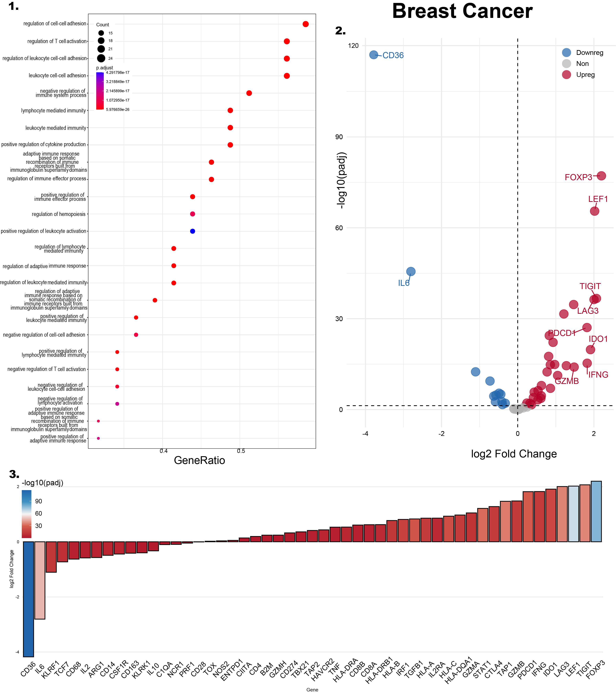

   The Differential Gene Expression analysis reveals:  
     
   a) Strong upregulation of FOXP3 can be observed (Volcano Plot), this FOXP3 is a major transcriptional factor of the Tregs (T regulatory cells). Tregs are responsible for shutting off the anti tumor immunity. They turn off the Killer T cells, which attacks the cancer. Cancers with high Treg can escape the attack of the immune system leading to breast cancer evasion and poor prognosis. This is also linked with the GO term (GO plot) “positive regulation of the immune system.”  
     
   b)  The immune checkpoint genes were also found to be strongly upregulated (Volcano Plot). Genes such as PCDC1, LAG3 and TIGIT were found to be highly expressed. This is related to the stress on the T cells and T cell dysfunction. LAG3 is a critical immune checkpoint for the T cells, LAG3 correlates with the PD-1 (another checkpoint for T cells), which is co-expressed by PCDC1. Significant upregulation of TIGIT is also noted, which is an inhibitory receptor and expressed on T cells and NK cells, It reduces the T cell activity and cytokine production. Over all this suggests exhaustion of the T cells and highly immuno supressive state which is helping the tumor to evade the immune attack, which is also in coherence with the GO pathway of “negative regulation of the T cell activation”.  
     
   c) From the Volcano plot and the bar plot, we can also see the upregulation of the IDO1, Its an enzyme that breakdowns the tryptophan into kynurenine, this causes tryptophan depletion which causes the T effectors to starve and T cells becomes dysfunctional and the kynurenine promotes the regulatory T cell and MDSC’s (Myeloid derived suppressor cells), overall signalling to the T cell damage in line with the “negative regulation of the T cell activation”.  
     
   d)Strong fold increase in the IFNG (Interferon Gamma) could also be observed,  which is a cytokine made mainly by the CD4+ T cells and the CD8+ T cells, mainly they are associated with the activation of the CTL(Cytotoxic T Lymphocytes), mainly acting against tumors, but it also activates IDO1 and STAT1 which helps the tumor in immune evasion, thus portraying a dual role, aligning with the GO Pathway “positive regulation of leucocyte mediated immunity.”  
     
   e) Granzyme B (GZMB), a protein made by the Cytotoxic T lymphocytes also expresses an upregulation, which mainly kills the tumor cells by apoptosis. This reflects that the immune cells are trying to attack the cancer cells too, opposite of what all we observed earlier.  
     
   f)  Strong upregulation of the HLA (Human Leucocyte Antigen) can be noted from the Barplot and the Volcano Plot. HLA-DRA, HLA-C, HLA-A are seemingly upregulated, all of which is concerned with the antigen presentation to the T cells, representing active immune recognition and suppressive mechanisms relating with the GO term “positive regulation of adaptive immune response”.  
     
   g)CD36 shows significant downregulation (Volcano Plot). CD36 being a fatty acid transporter, this means that this downregulation will limit the fatty acid uptake in the tumor metabolism (reducing the energy metabolism), thus creating an anti-tumor condition. This also corresponds to the GO term “regulation of hemopoiesis.”  
     
   h) Significant downregulation can also be observed in IL6 activity, which being a cytokine is involved in inflammation and immune signalling. IL6 promotes tumor growth and survival via the STAT3 signalling pathway and supports immunosuppression. Downregulation of the IL6 corresponds to reduction in the pro tumor inflammation which curbs the tumor growth.

Our Analysis highlights the dynamic nature of the immune system in Breast Cancer regulation. Tumors show active immune recognition, immune filtration with metabolic suppression while the Treg immunosuppression and T cell exhaustion is also notable. Overall representing a balance between pro-tumor and anti-tumor activities.

2. Colon Adenocarcinoma (COAD) :

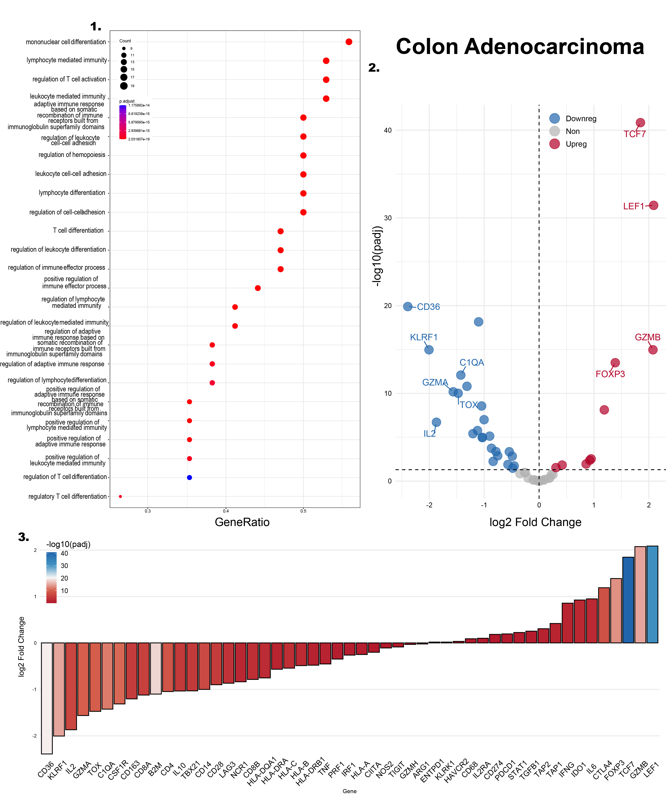

1) TCF7 shows a significant upregulation, which is a transcription factor for the T cell development and differentiation, resulting in the promotion of T cell formation and T cell memory formation. High TCF7 suggests a robust immune environment indicating that the T cells are active against the tumor cells. This as well correlates to the GO term “regulation of T cell differentiation.”  
2) Another transcription factor LEF1 is also significantly upregulated (volcano plot). LEF1 acts closely with TCF7 and regulates the T cell stemness and differentiation, helping the T cells to maintain long term anti tumor responses. Thus acting in hand with the TCF7 in acting against the Tumor cells. GO pathways like “T cell differentiation” and “regulation of T cell differentiation” also represent the same.  
3) Like in BRCA, here also we see significant upregulation of the FOXP3 gene, which activates the Treg and in turn acts as pro-tumor and helps in evasion of the immune responses.  
4) An elevation of GZMB is also observed here in COAD, which indicates cytotoxic activity and apoptosis promoting anti-cancer and pro-immune environments correlating to the GO term “positive regulation of leucocyte mediated immunity” .  
5) TOX showed a significant downregulation, TOX plays a role in T cell exhaustion as well as in T cell development. So, its downregulation suggests a more active T cell but in the context of T cell development, downregulation of TOX indicates impaired T cell function, thus playing a complex role.  
6) We also observe downregulated functions of NCR1(NKp46) and KLRF1 which act in activating NK cell receptors and differentiation of the NK cells respectively. Downregulation means impaired activity of NK cells which reduces the immune surveillance.

In this case too we observe COAD showing a complex balance of T cell activation and suppression. We observe T cell stemness and T cell differentiation along with NK cell dysregulation.

3\. Head and Neck Squamous cell Carcinoma:

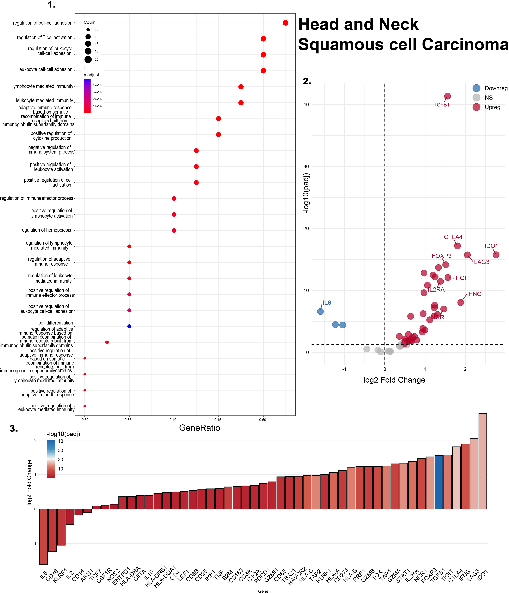

1) FOXP3 is strongly upregulated, which regulates the Tregs and suppresses T cell responses, similar to what is observed in Breast cancer. It also correlates with the GO term “T cell differentiation”  
2) CTLA4 upregulation is also observed, which serves as an immune checkpoint on the T cells. It is related to functions such as inhibition of the T cell activation and proliferation. High CTLA4 suggests reduced anti-tumor activity.  
3) HLA genes such as HLA-A, HLA-B, HLA-C also seem to be strongly upregulated, this directly correlates to the increase in the presentation of the antigens to the T cells, leading to effective immune recognition.  
4) TGFB1 demonstrates statistically strong upregulation, which regulates both the immune cells and the tumor cells as well. TGFB1 promotes the Treg differentiation and inhibits the CTLs, dampening their ability to kill. It also increases the efficacy to carry out the EMT (Epithelial-Mesenchymal-Transition) making the tumor more immunosuppressive, which is reflected by the GO term “negative regulation of immune system process”.  
5) IFNG along with GZMB show strong upregulation. IFNG as explained earlier acts anti-tumor by producing the CTLs and Granzyme B plays a role by triggering apoptosis, thus actively participating in the killing of the tumors.  
6) Upregulation of IDO1 can also be observed from the Volcano plot. IDO1 as mentioned earlier breaks tryptophan into kynurenine resulting in a portable environment for tumor and starving of the T cells, correlated with the GO term “negative regulation of immune system process”.  
7) Significant downregulation could be noted in the IL6, as seen earlier which relates to reduction in the pro tumor inflammation which curbs the tumor growth.

HNSC also displays a complex interplay of the immune mechanisms with both suppressive and immune active features.

4\. Kidney Renal Clear cell Carcinoma:

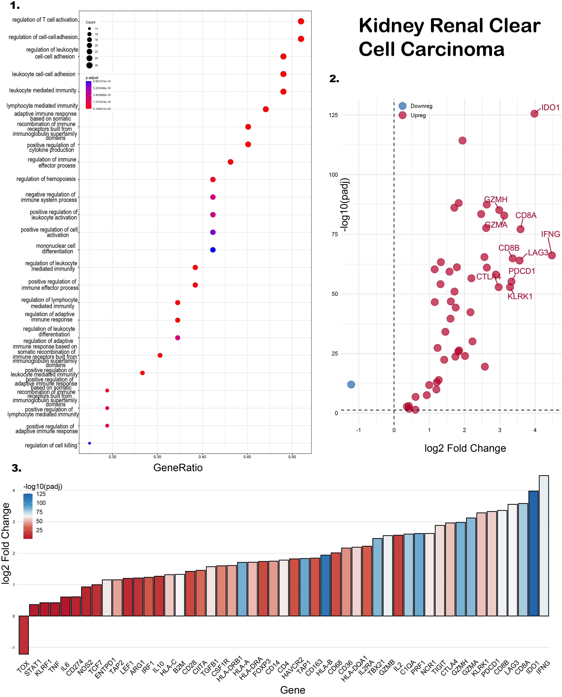
 

1) IDO1 shows exceptional upregulation (Volcano and Bar plot),IDO1 as mentioned earlier breaks tryptophan into kynurenine resulting in a portable environment for tumor and starving of the T cells, correlated with the GO term “negative regulation of T cell process”.  
2) INFG and GZMH also show significant upregulation here too, displaying high anti-tumor activity and involvement of the immune system in killing of the tumour cells.  
3) PDCD1 along with LAG3 and TIGIT are highly expressed, thus contributing to T cell dysfunction and exhaustion as seen earlier. The GO term “negative regulation of immune system process” conveys the same.  
4) CD36 upregulation is also observed, CD36 is associated with lipid metabolism and fatty acid transport and expressed on tumor associated macrophages, by increasing lipid metabolism, macrophages shift to immunosuppressive state and thus fitting into the GO category of “regulation of lipid metabolic process.” A stark contrast to the previously observed cancers.  
5) Significant upregulation of the genes associated with the Natural Killer cells is also observed, such as in NCR1 and KLRK1 helping in NK cell activation and recognition leading to the killing of the tumors.   
6) TOX is downregulated significantly as seen in previous cancer types. Its downregulation suggests a more active T cell but in the context of T cell development, downregulation of TOX indicates impaired T cell function, thus playing a complex role.

5\. Kidney Renal Papillary Cell Carcinoma:

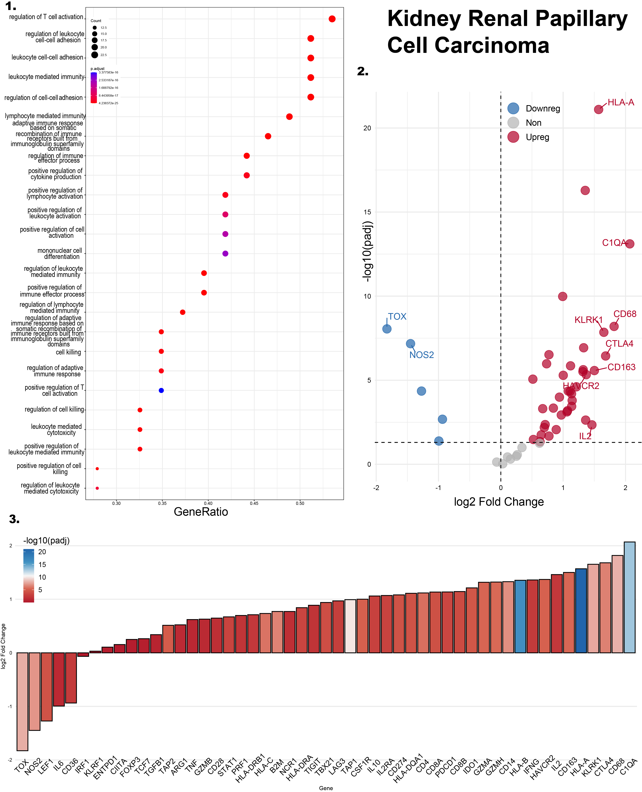

1) C1QA presents exceptional upregulation, it is primarily responsible for the complement system and initiating the classical complement pathway, aiding in opsonization and immune responses with the help of macrophages and dendritic cells. Upregulation of C1QA indicates high immune infiltration and helping to fight cancer and leading to anti-tumor activity coherent with the GO term “regulation of immune effector processes”.  
2) CD68 also shows significant upregulation, CD68 is a marker of macrophage infiltration reflecting the attacking efficiency of the macrophage.  
3) HLA-A upregulation could also be noted, indicating enhancement in the antigen presentation similar to seen in previous cancer data also. The GO term “adaptive immune response based on somatic recombination”.  
4) Substantial upregulation could also be noted in HAVCR2. HAVCR2 codes for TIM3 which is an immune checkpoint which marks for T cell exhaustion. This tells that a high amount of the T cells are exhausted within the KIRP.  
5) As observed in other cancer types, here also we note a CTLA4 upregulation, an immune checkpoint marker on the T cells. It is related to functions such as inhibition of the T cell activation and proliferation. High CTLA4 suggests reduced anti-tumor activity.  
6) The down regulation of the TOX is also seen, as seen in previous cancer types, that does not necessarily mean good or bad, but a marker of the T cell exhaustion.  
7) LEF1 downregulation could be observed, LEF1 is Lymphoid Enhancer Binding Factor1, which is a transcription factor with TCF7. It helps in T cell memory and stemness. So, the reduction in the LEF1 means a reduction in the anti tumor activities.

6\. Liver Hepatocellular Carcinoma:

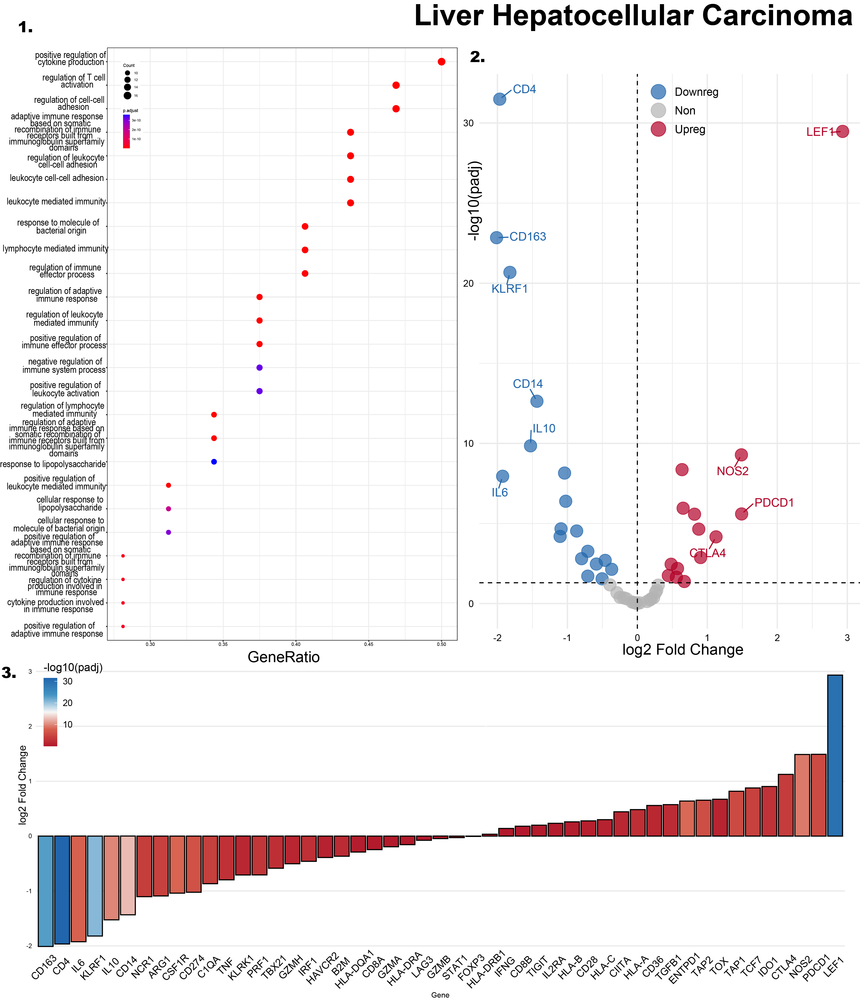

1) LEF1 (Lymphoid Enhancer Factor 1\) shows a strong upregulation, LEF1 being a transcription factor in beta catenin signaling pathway promotes EMT (Epithelial Mesenchymal Transition) helping the cancer cells, also associated with metastasis. But as noted earlier, LEF1 also plays a major role in T cell stemness and memory thus playing both the roles, which is shown by the GO term “positive regulation of adaptive immune response”.  
2)  Significant upregulation is also seen in NOS2 (Volcano Plot), which catalyzes NO (nitric oxide) production. NO plays a dichotomous role in cancers . Thus, NO can do tumor suppression but can also contribute to tumor growth too by simultaneously maintaining major oncogenic pathways like Akt/PI3K and RAS/ERK to HIF1a and TGFb .  
3) Upregulation of PDCD1 is also notable playing an important role in inhibiting the T cell activation and cancer progression.The GO term “negative regulation of immune system processes” reflects the pathway.  
4) IDO1 upregulation from the Volcano plot infers metabolic pathway upregulation in the tryptophan depletion to kynurenine, playing a role in suppressing the T cell activity, echoed by the GO term “negative regulation of immune system process”.  
5) Significant Downregulation could be observed in CD163, which is mainly expressed on Macrophages and promotes anti-inflammatory signalling and metastasis. Lower expression of CD163 signals a reduced number of Macrophages which corresponds to less suppression of CTLs. CD163 has yet been more of a marker for Hepatitis rather than a marker for tumor progression .  
6) Lower expression of KLRF1 suggests the lesser activation of the NK cells, signifying the reduced ability to lyse the tumor, aligned with the GO term “leucocyte mediated cytotoxicity”.   
7) IL10 downregulation signifies less immune suppression, so the CTL and NK cells can be more active.

7\. Lung Adenocarcinoma:

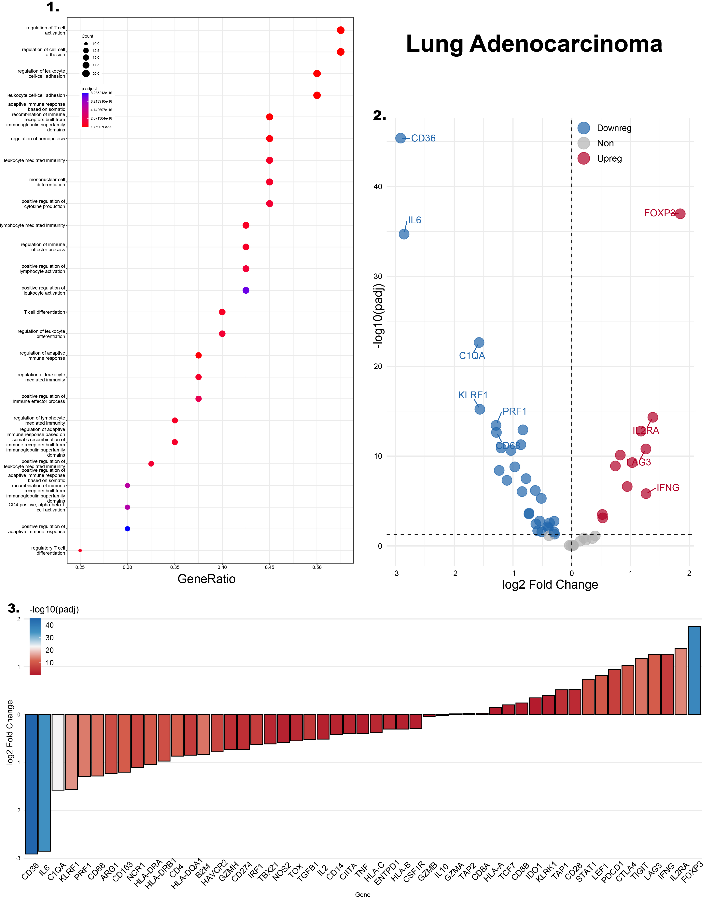

1) Strong upregulation of FOXP3 (Forkhead Box protein 3\) suggests more Treg present as seen in earlier cancer types which in turn causes shutting of anti cancer immunity.   
2) LAG3 was seen to be upregulated, LAG3 or Lymphocyte activation gene 3 is an immune checkpoint gene, it prevents the immune system from over activation, providing inhibitory signals to T cells. LAG3 upregulation refers to lack of immune protection from tumor, aligning with the GO term “negative regulation of the immune system process”.   
3) The upregulation of IL2RA is also noted from the Barplot and Volcano plot. IL2RA codes for CD25 (a part of IL-2 receptor) which in effect plays a role in growth and maintenance of  Tregs. More IL2RA corresponds to exceeded survival of Tregs which will lead to more suppression of CTL, leading to poorer prognosis.  
4) Strong downregulation of CD36 could be observed, CD36 being a transmembrane fatty acid transporter part takes in metabolism of lipid and lipid uptake which in turn fuels tumor cells, Low CD36 means less fatty acid uptake and lesser proliferation rate for the tumor.   
5) C1QA is significantly downregulated, which is responsible for the complement system. Lower C1QA means lesser tumor anti tumor immunity.  
6) Perforin (PRF1) is downregulated, which is critical for cytotoxic immunity, it forms pores on the cell membrane of the target cells and induces apoptosis. It plays a major role in killing the cancer cells. Its lesser expression corresponds to a greater evasion of immune responses by the cancer cells.  
7) A downregulation of KLRF1 is observed from the Volcano plot, which is an activator of the NK cells and helps in killing tumors. Lower KLRF corresponds to lower HK cells means less activated immune response and weakened immune surveillance.

8\. Lung Squamous cell Carcinoma:

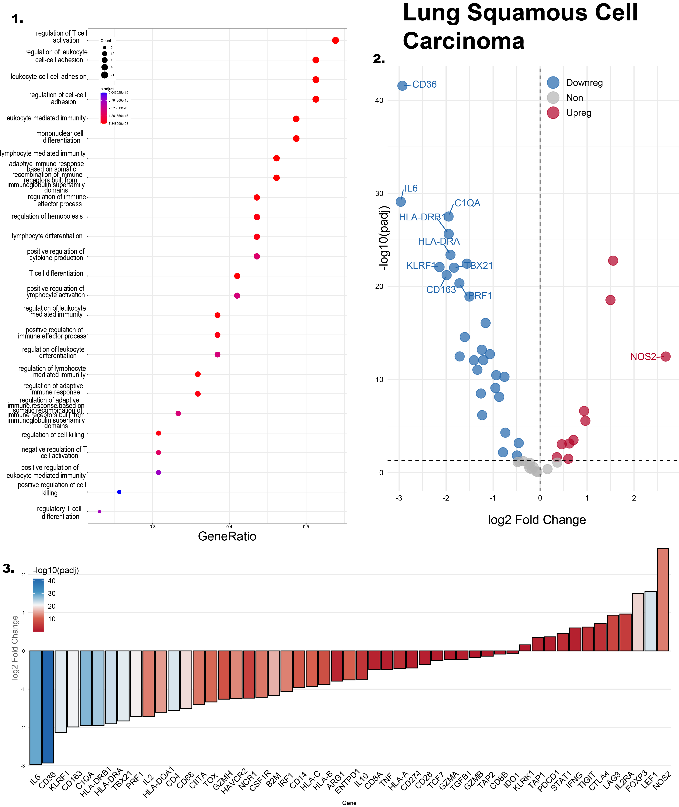

1) From the Volcano Plot we infer a strong upregulation of the NOS2, which is responsible for inducible Nitric oxide synthase production which will boost NO. Now, NO has a dual role: it can kill tumor cells but can also promote tumor progression via inflammation.  
2) As seen in previous cancers CTLA4 is upregulated here too, It plays a role in inhibition of the T cell activation and proliferation. High CTLA4 suggests reduced anti-tumor activity.   
3) IL6 downregulation (Volcano Plot) leads to reduction of tumor inflammation and immunosuppression leading to anti cancer immunity and increased response to immunotherapy.  
4)  We observe downregulated CD36 in this case too as seen in LUAD. Low CD36 means less fatty acid uptake and lesser proliferation rate for the tumor.   
5) Reduced KLRF1 could also be noted from the Volcano Plot.Lower KLRF corresponds to lower HK cells means less activated immune response and weakened immune surveillance.  
6) HLA-DRB1, a MHC class II gene is significantly downregulated, which mainly presents antigen to helper T cells, reduced gene activity means weakened immunity and more tumor evasion probability.

9\. Prostate Adenocarcinoma:

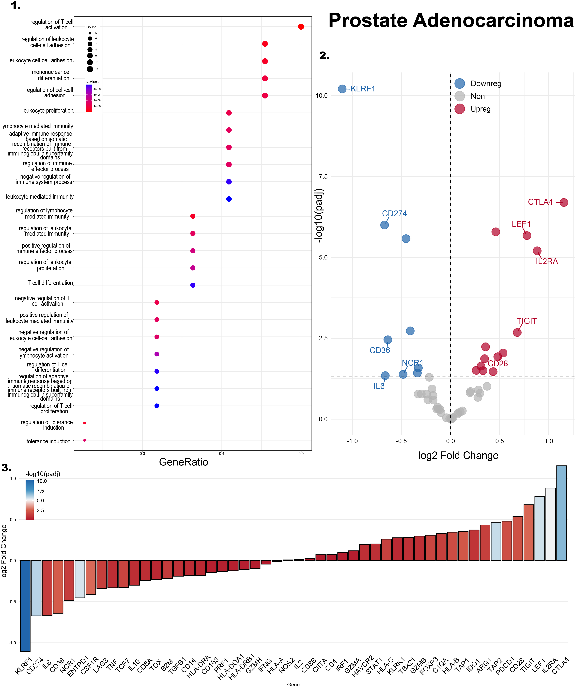

1) CTLA4 is upregulated (Volcano Plot), which is an immune checkpoint regulator,an immune checkpoint marker on the T cells. It is related to functions such as inhibition of the T cell activation and proliferation. High CTLA4 suggests reduced anti-tumor activity, correlating with the GO term “negative regulation of T cell activation”  
2) ILR2A is upregulated, which suggests the Treg regulation and suppressing anti-tumor immunity, this helps in immune evasion and poor prognosis of the tumor. It corresponds to the GO pathway “regulation of T cell proliferation”.  
3) TIGIT shows a significant upregulation, which has an inhibitory effect of the T cells and NK cells thus suppressing cytokine production. It directly correlates with the GO term “negative regulation of lymphocyte activation”.  
4)  KLRF1 downregulation could also be noted from the Volcano and Bar plot. KLRF1 is primarily expressed on NK cells and activates them, Downregulation of KLRF1 impairs the tumor suppression and causes poorer prognosis.  
5) NCR1 is significantly downregulated, which is an activating receptor of NK cells. Its downregulation refers to reducing tumor perforation and lesser innate immunity.  
6) Strong Downregulation of CD274 is noted, it encodes for PDL1 which binds to PD1 on T and NK cells, which helps in the killing of cancer cells and carry out immune responses. Downregulation of it can help immune evasion of cancers. It is correlated with the GO term “negative regulation of immune system process”.

10\. Stomach Adenocarcinoma:

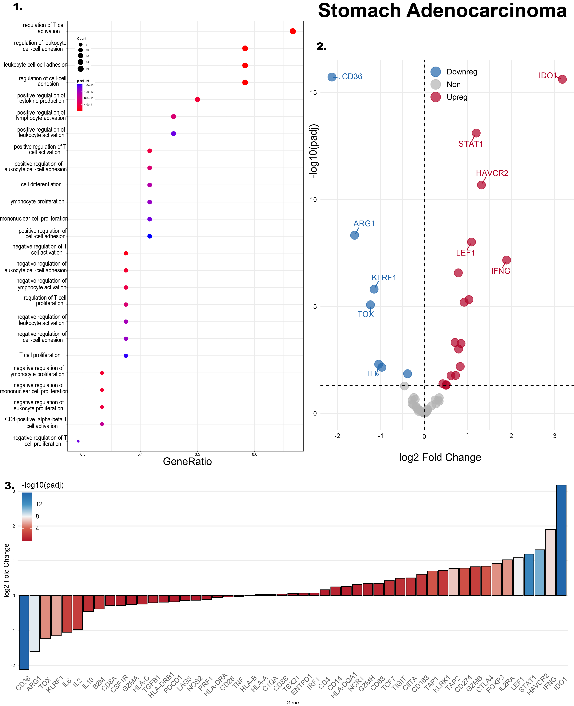

1) As seen in earlier cancer types, IDO1 is strongly upregulated here also, which aids in the conversion of tryptophan to kynurenine, aiding in tryptophan catabolism which depletes the tryptophan. T cells need tryptophan to proliferate. Low tryptophan inhibits T cell function and indirectly is opposing immune responses against the tumor. It aligns directly to the GO term “Negative regulation of T cell proliferation”.  
2) HAVCR2 is strongly upregulated, HAVCR2(TIM-3) is an inhibitory checkpoint expressed on T regs and exhausted T cells. Its upregulation indicates T cell exhaustion.  
3) LEF1 upregulation could be inferred from Volcano Plot. LEF1 plays a role in the regulation of  T cell stemness and differentiation, helping the T cells to maintain long term anti tumor responses. GO pathways like “T cell differentiation” are in coherence with this.  
4) CD36 is significantly downregulated, which acts in lipid metabolism and fatty acid uptake.This  downregulation will limit the fatty acid uptake in the tumor metabolism (reducing the energy metabolism), thus creating an anti-tumor condition.  
5) ARG1 is also significantly downregulated as inferred from the Volcano Plot. ARG1 converts arginine to ornithine and urea causing Arginine depletion. It basically affects the MDSC mediated evasion.  
6) KLRF1 is also downregulated, acts by activating NK cell receptors and differentiation of the NK cells respectively. Downregulation means impaired activity of NK cells which reduces the immune surveillance and anti-tumor activity.

11\. Uterine Corpus Endometrial Carcinoma:

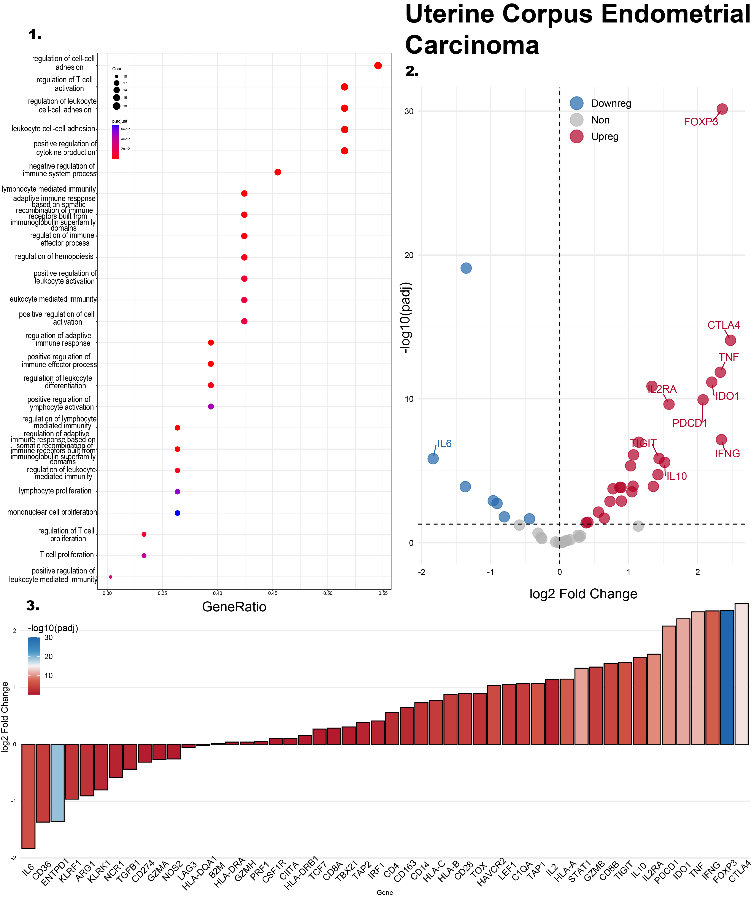

1) Strong upregulation of FOXP3 is observed,  this FOXP3 is a major transcriptional factor of the Tregs (T regulatory cells). Tregs are responsible for shutting off the anti tumor immunity. Thus, cancers with high FOXP3 can escape immune attack.  
2) Genes such as PDCD1, CTLA4 and TIGIT were upregulated, these are the immune checkpoint genes. They are related to stress on the T cells and cause T cell dysfunction and cytokine reduction. This overall causes T cell exhaustion and reduction in T cell activity thus aiding cancer in propagation.  
3) IFNG was seen to be upregulated, and helps in the production of Cytotoxic T lymphocytes. This is a key regulator of anti-tumor immunity and aiding immune attack. The GO term "positive regulation of leukocyte mediated immunity".  
4) HLA genes such as HLA-B, HLA-C, HLA-A are strongly upregulated which is concerned with antigen presentation to the T cells, thus playing a major role in immunity against cancer.  
5) GZMB (Granzyme B) gene is significantly upregulated which aids in Tumor cell killing via perforin mediated pores and in turn leading to apoptosis, directly correlating to the GO term “leukocyte mediated cytotoxicity".  
6) Downregulation of ENTPD1 signals to lesser immunosuppression, leading T cells and NK cells to function effectively.  
7) Arginase1 (ARG1) is significantly downregulated, mainly expressed by myeloid derived suppressor cells and macrophages. It plays a role in T cell suppression and immune evasion. Lowering ARG1 means boosting T cell function and increasing immune responses.  
8) IL6 is significantly downregulated,  IL6 promotes tumor growth and survival via the STAT3 signalling pathway and supports immunosuppression. Downregulation of the IL6 corresponds to reduction in the pro tumor inflammation which curbs the tumor growth.  
 

12\. Kidney Chromophobe:

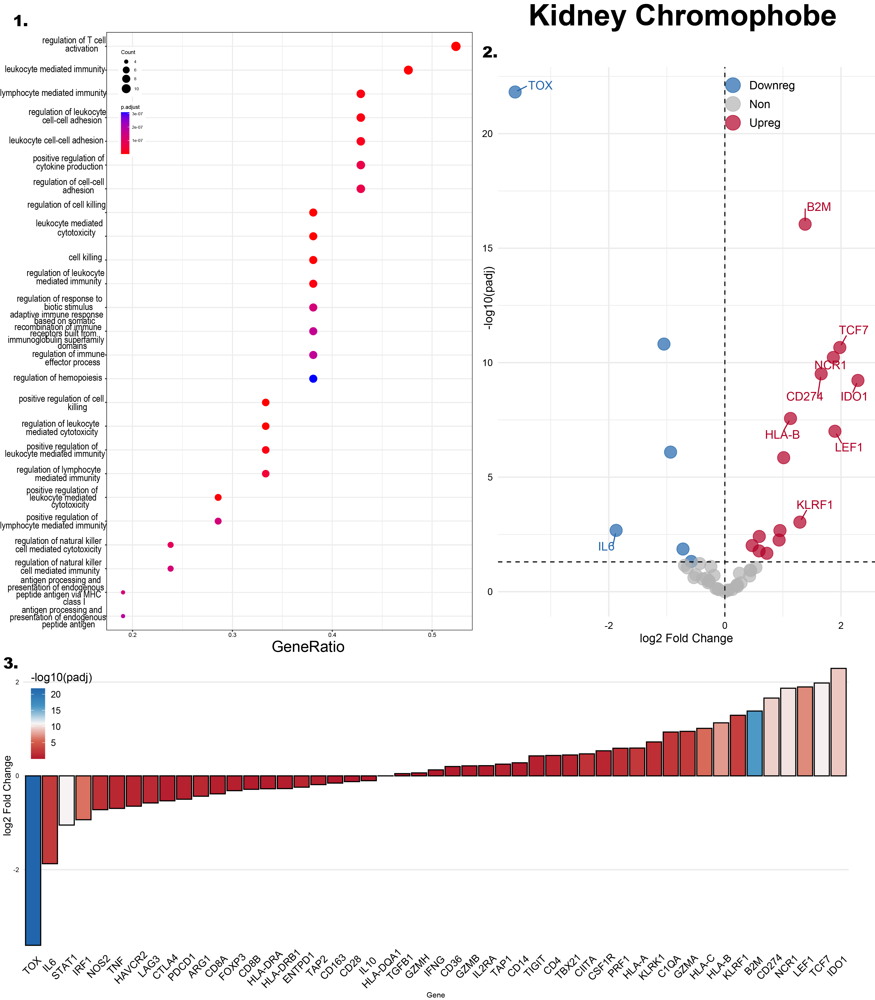

1) B2M is significantly upregulated, It helps in the MHC I presentation and enhances the immune recognition, it also plays a role with the HLA relating to antigen presentation. It aligns closely with the GO term “antigen processing”.  
2) Strong upregulation of NCR1 is also visible, It helps in the tumor recognition and activates the NK cell to attack the tumor and release cytokine, thus portraying a crucial antitumor role. An upregulation signifies high anti-tumor immunity. It correlates to the GO term “leucocyte mediated cytotoxicity”.  
3) KLRF1 shows significant upregulation, it is expressed on NK cells and cytotoxic T cells. It regulates the NK cell mediated cytotoxicity. It thus helps in better survival in cancers, correlating with the GO term “regulation of natural killer cell mediated cytotoxicity”.  
4) CD274 is also upregulated as inferred from the volcano plot, it encodes for PDL1 which binds to PD1 on T and NK cells, which helps in the killing of cancer cells and carry out immune responses. An upregulation suggests an efficient anti tumor activity.  
5) TOX plays a role in T cell exhaustion as well as in T cell development. So, its downregulation suggests a more active T cell but in the context of T cell development, downregulation of TOX indicates impaired T cell function, thus playing a complex role.  
6) IRF1 downregulation could be noted from the Volcano Plot. It regulates the type I and type II signalling of the interferons along with MHC class I and class II genes. Downregulation of IRF1 means lowering expression of MHC which aids the cancer in immune evasion.  
7) LAG3 (Lymphocyte Activation Gene 3\) is significantly downregulated, which is an immune checkpoint regulator. It binds to MHC II molecules and transmits inhibitory signals that will reduce the T cell proliferation and cytokine production. Downregulation of LAG3 means maintaining immune response.

13\. Thyroid Adenocarcinoma:

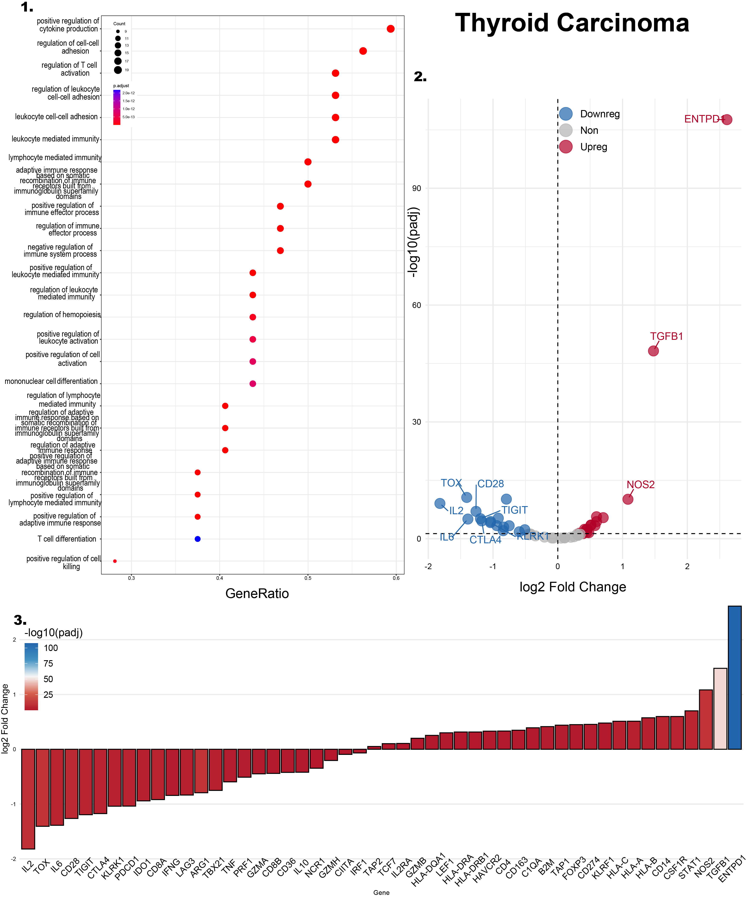

1) ENDP1 shows exceptional upregulation, it is an ecto nucleotidase which is expressed on T regs and exhausted T cells. They majorly play a role in ATP depletion and Adenosine accumulation, affecting the immune response in a negative way, aligning with the GO term “negative regulation of immune system process”.  
2) TGFB1 also shows significant upregulation, it creates an immuno supressive environment and CTL inhibition, which helps in immunosuppressive microenvironment.  
3) Strong upregulation of CSF1R is visible, indicating more differentiation and proliferation of macrophages and forming of macrophages from monocytes. It also promotes infiltration and survival of macrophages in the tumor microenvironment.  
   It is correlated with the GO term “Regulation of leukocyte differentiation”.  
4) Significant upregulation of HLA-A, HLA-B and HLA-C is also seen which mainly presents the antigens to the T cells and helps in anti-cancer activity and helping in immune responses.  
5) IL2 is downregulated as inferred from the Volcano plot, It ia a central cytokine for the adaptive immunity. It also helps with the T cell activity and immunity of the body against the tumor. Downregulation suggests less stimulation of the T cell pathways.  
6) As seen in previous cancer types, we here see  TOX downregulation. It  plays a role in T cell exhaustion as well as in T cell development. So, its downregulation suggests a more active T cell but in the context of T cell development, downregulation of TOX indicates impaired T cell function, thus playing a complex role.  
7) CD28 is significantly downregulated, which provides a signal for T cell activation. Downregulation of CD28 means lesser T cell activation and proper immune evasion.

An overall Heatmap comparison of all the 52 genes across 13 cancer types:

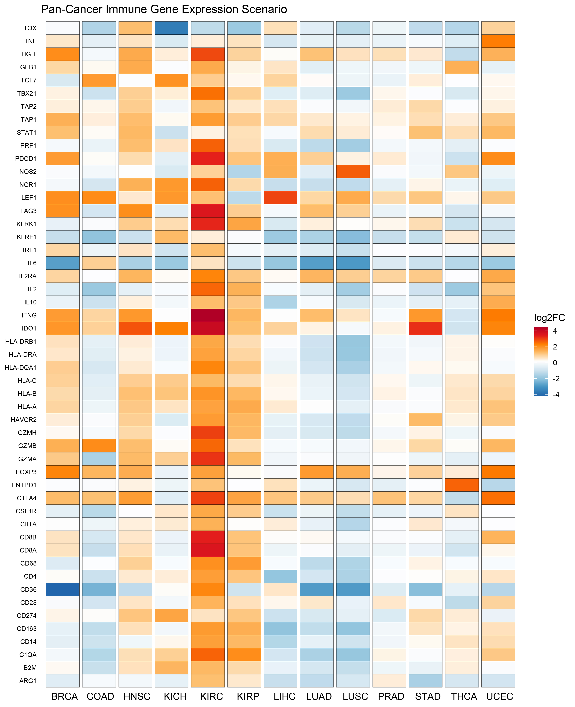

